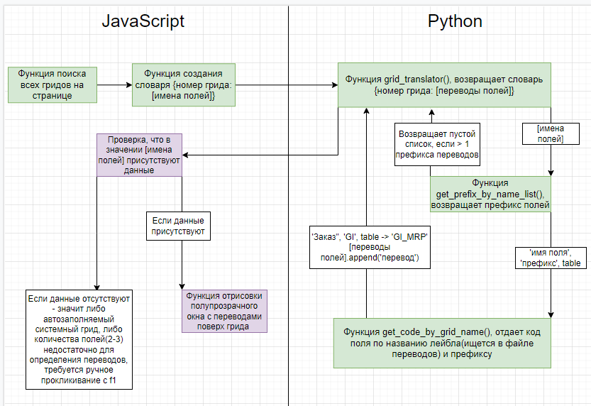
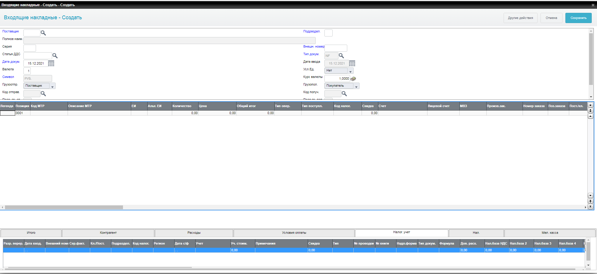
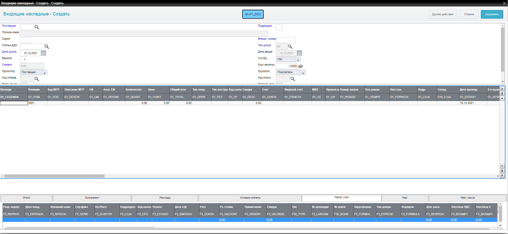

# Скрипт для показа имен полей и имен гридов в рутинах

### Для работы скрипта требуется запустить браузер на любом свободном отладочном порту:

```
"<path-to-browser>" --remote-debugging-port=<free-port> --user-data-dir="<path-to-folder-where-will-be-user-data>"
```
### После перехода в нужную рутину следует запустить файл connect_session.py, указав в opt.add_experimental_option порт, на котором работет браузер

### Время подгрузки всех полей гридов составляет ~10 сек.

### Задача:
    Сделать скрипт, который показывает коды полей и коды ячеек гридов

### Принцип работы:

    
    Первая часть JS-скрипта берет ID полей из DOM-дерева по наведению и транслирует их в 
    отрисованное вспомогательное окно. С гридами работа осложняется тем, что до клика по полю в 
    DOM-дереве нет информации об элементе. 
    Решение:
    Связка Python-Selenium-JavaScript: Python с помощью Селениума подключается к браузеру
    на отладочном порту, после чего в этой сессии можно зайти в нужную рутину, запустить скрипт,
    который спарсит имена полей гридов, сформирует словарь формата {номер грида: [список переовдов
    полей] и передаст в Python, который в свою очередь обращается к файлу переводов и формирует 
    исходящий словарь {номер грида: [список имен полей], который передается обратно в бразуер, 
    где JavaScript отрисовывает дополнительную строку с именами. 
### Блок-схема, как работает вторая часть скрипта:


### Страница до:


### Страница после:

